<div align="center">



<br>

[](https://react.dev)
[](https://vite.dev)
[](https://www.typescriptlang.org)
[](https://tailwindcss.com)
[](https://gsap.com)

Landing inmersiva para **Solarion**, energía solar portátil hecha en Popayán, Colombia.

</div>

<br>


## La experiencia

Toda la página vive en blanco y negro, los cinco tonos exactos de la guía de marca. El color existe, pero hay que ganárselo: el cursor es una linterna que lo revela al pasar sobre cada imagen.

El scroll cuenta una historia. Se entra por una puerta que pide deslizar (con un golpe de sonido espacial sintetizado en Web Audio, sin un solo mp3), el titular rota frases letra a letra, el producto se presenta con la foto anclada mientras sus pilares se encienden, los territorios se recorren en un viaje horizontal con palabras fantasma cruzando en paralaje, la historia se dibuja sobre un cable energizado y el wordmark del cierre se carga letra por letra como una batería. Una batería vertical en el margen marca cuánto llevas: la página se carga contigo.

| | | | | |
|:-:|:-:|:-:|:-:|:-:|
|  |  |  |  |  |
| `#0A0A0A` | `#212121` | `#424242` | `#AAAAAA` | `#FFFFFF` |


## Correr el proyecto

```bash
npm install
npm run dev        # desarrollo en localhost:5173
npm run build      # build de producción
npm run preview    # sirve dist/ en localhost:4173
```


## Cómo está organizado

```
src/
  animations/      una animación GSAP por archivo, cada una devuelve su cleanup
  components/
    landing/       secciones encapsuladas: hero, manifesto, product, solutions,
                   stats, testimonials, story, cta, nav, footer
    ui/            piezas transversales: puerta de entrada, cursor de luz,
                   velo monocromo, batería de scroll, botón de regreso
  hooks/           useLenis, useAnchorScroll, useSplitReveal, useReducedMotion...
  constants/       todo el copy y los datos reales del negocio en un solo lugar
  lib/             registro de GSAP, referencia de Lenis, sting de audio
  styles/          tokens de marca y base (Tailwind v4)
```

Las reglas de la casa: solo se animan `transform`, `opacity` y `filter`; los canvas se pausan fuera de viewport y limitan su DPR; los loops se detienen al ocultar la pestaña; y absolutamente todo el motion colapsa con `prefers-reduced-motion`. El scroll sostiene 60 fps con margen.

## Verificación

En `scripts/` hay herramientas de QA con puppeteer: capturas a cualquier profundidad de scroll y con el mouse posado donde quieras, medición de FPS por sección y un recorrido E2E que cruza la puerta, espera la rotación del titular y lee la batería de scroll.

```bash
node scripts/fps.mjs
node scripts/verify-gate.mjs
```

<br>

<div align="center">


**Solarion** · Popayán, Cauca, Colombia

</div>
